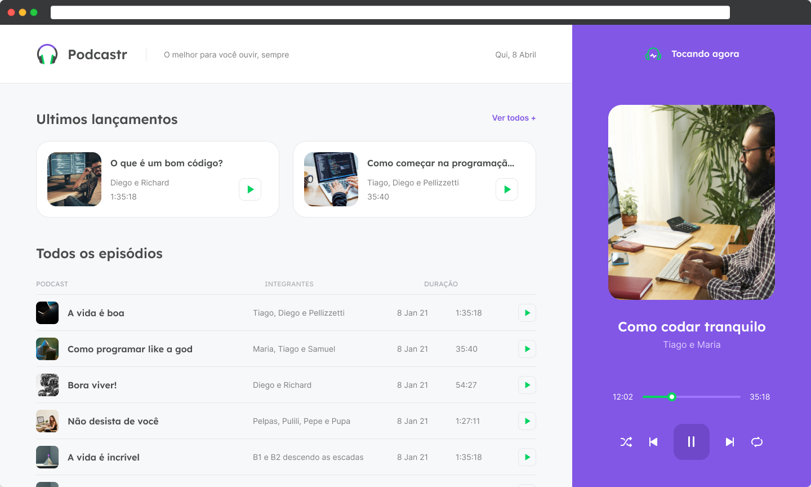

<div align="center">
  
</div>

## Podcastr

[](https://github.com/CauaMatheus)
[](#)

<h4 align="center">
  Podcastr é uma plataforma criada para transmissão de vários podcasts.
</h4>



## Tecnologias

Esse projeto foi desenvolvido usando tecnologias de ponta para o front-end.

- [ReactJS](https://reactjs.org/)
- [Typescript](https://www.typescriptlang.org/)
- [Next.js](https://nextjs.org/)

## 💻 Como usar

**Clone o projeto e entre no diretório**

```bash
$ git clone https://github.com/CauaMatheus/podcastr.git && cd podcastr
```

**Instale as dependências e rode o app**

```bash
# Para instalar dependências
$ yarn

# Para rodar o app
$ yarn dev
```

Após rodar o comando `yarn dev`, o app estará disponível em `http://localhost:3000`